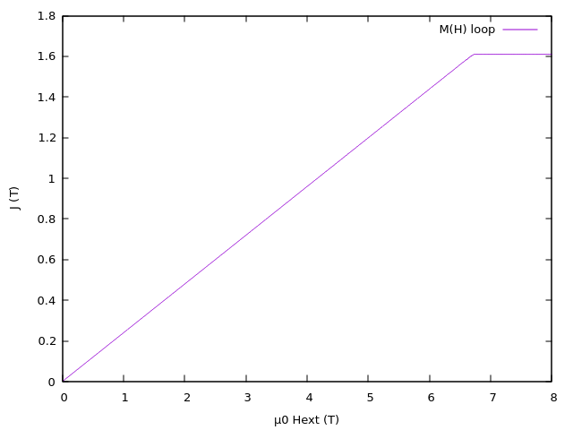

---

# hard_axis_loop

## 1) Purpose of the Example
This example demonstrates the behavior of a **uniaxial anisotropic permanent magnet** when an external magnetic field is applied along its **hard axis**. The goal is to test the contributions of **anisotropy energy** and **Zeeman energy** in the micromagnetic solver. For a spherical particle, the demagnetizing field is uniform and antiparallel to the magnetization, so it does not alter the saturation field. The magnetization rotates uniformly into the field direction, and the M(H) loop is a straight line until saturation is reached at the anisotropy field.

---

## 2) Physics Background
- **Anisotropy energy** favors alignment of magnetization along the easy axis (here, the z-axis).
- **Zeeman energy** favors alignment with the external field (here, along the y-axis, the hard axis).
- **Demagnetizing field** for a sphere is uniform and antiparallel to magnetization; it does not change the saturation field.
- The particle should saturate at the **anisotropy field**:

$$
\mu_0 H_{ani} = \mu_0 \frac{2 K_1}{J_s}
$$

With the parameters of Nd\(_2\)Fe\(_ {14}\)B (\(K_1 = 4.3 \times 10^6 \; \text{J/m}^3\), \(J_s = 1.61 \; \text{T}\)), the anisotropy field is 

\(\mu_0 H_{ani} =6.71 \; \text{T}\)


- **Magnetostatic energy of a sphere**:

We also check the magnetostatic field computation. For a sphere there is an analytical solution for the magnetostatic energy.
$$
E_{mag} = \frac{1}{2} \mu_0 N M_s^2 V
$$

For a sphere, \(N = \frac{1}{3}\). This formula is used to check the relative error printed by the solver when using `--print-energy`.

---

## 3) How to Run the Example
First, create the mesh for the sphere (already done in this example):
```bash
python mesh.py --geom ellipsoid --extent 30,30,30 --h 2 --backend meshpy --out-name sphere
```
This creates:
- `sphere.npz` (mesh)
- `sphere.vtu` (for visualization)

The material and configuration files are:
- `sphere.krn` — Nd₂Fe₁₄B parameters 
- `sphere.p2` — simulation setup

The simulation setup is
  ```
  [mesh]
  size = 1.0e-9

  [initial state]
  mx = 0.
  my = 0.01
  mz = 1.

  [field]
  hstart = 0.01
  hfinal = 8.0
  hstep = 0.01
  hx = 0.
  hy = 1.
  hz = 0.
  mstep = 0.4
  mfinal = -2.0

  [minimizer]
  tol_fun = 1e-8
  tol_hmag_factor = 1
  ```
Notes: 
to break the symmetry we add a small initial tilt to the magnetization.
`mfinal` is for backward compatibility and not used in the current solver.

Run the simulation:
```bash
python run_example.py --example hard_axis_loop -- --mesh sphere --print-energy
```

The flag `--print-energy` shows the magnetostatic energy of the initial state and its relative error compared to the analytic formula above.

---

## 4) How to Analyze and Interpret Results
The energy of the initial state is computed

````
[Step 5] Initial energies
 Brown (magnetostatic energy density) 3.400401e+05 J/m3
 Brown (magnetostatic energy) 4.796816e-18 J
 Magnetostatic energy density 3.437879e+05 J/m3 (Nz=0.333333)
 Magnetostatic energy 4.849685e-18 J
 Relative error -1.090167e-02
````

The relative error in the energy is around one percent.

After the run, you will have:

- `sphere.dat` — columns include external field and magnetization components.
- VTU files for visualization.
  Please note: The files are named `sphere.number.vtu`. The file with the *number = 0* is the initial state. All other numbers appear in the `sphere.dat` file in the first column. The second column is the corresponding field value.

To plot the magnetization curve:
```bash
gnuplot -persist -e "set xlabel 'µ0 Hext (T)'; set ylabel 'J (T)'; plot 'sphere.dat' using 2:5 with lines title 'M(H) loop'"
```
Here:
- Column 2 = external field (µ₀Hext in Tesla)
- Column 5 = magnetization along the field direction (J in Tesla)



**Interpretation**:

- The M(H) curve should be nearly a straight line until saturation.
- Saturation occurs at approximately the anisotropy field (\(\mu_0 H_{ani} = 6.71 \text{T}\).)
- The demagnetizing field does not affect the saturation field for a sphere.

---

