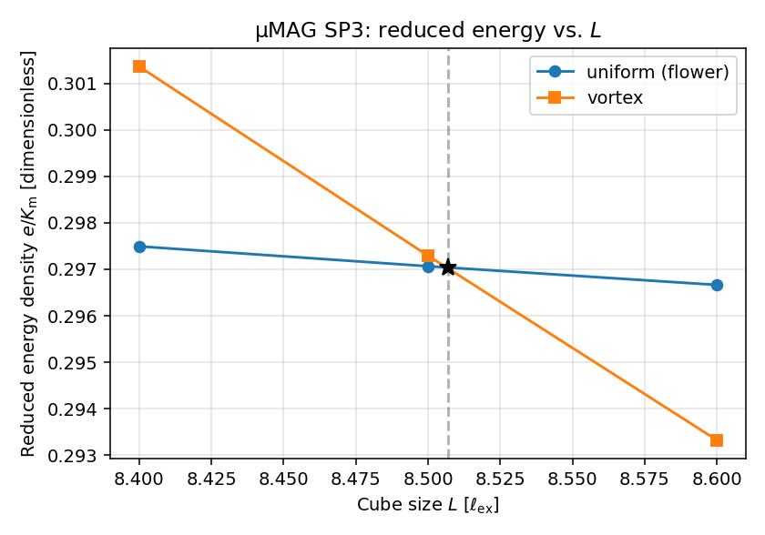

# standard_problem_3

## 1) Purpose of the Example

This problem tests the implementation of the magnetostatic, exchange, and anisotropy energy.

The  [µMAG Standard Problem #3](https://www.ctcms.nist.gov/~rdm/spec3.html)  focuses on determining the single-domain limit of a cubic ferromagnetic particle. This involves finding the critical size \(L\) at which two competing magnetization configurations—the flower state and the vortex state—have equal total energy. The cube’s edge length is expressed in units of the exchange length \(l_{\text{ex}} = \sqrt{A/K_m}\), where \(A\) is the exchange stiffness and \(K_m\) is the magnetostatic energy density \((K_m = \frac{1}{2}\mu_0 M_s^2\) in SI units). The material is assumed to have a small uniaxial anisotropy (\(K_u = 0.1 K_m\)) with its easy axis aligned along a principal axis of the cube.

## 2) Physics Background

 The problem is physically motivated by the competition between exchange, magnetostatic, and anisotropy energies, which govern the stability of magnetic states in small particles. The transition between flower and vortex states typically occurs near \(L \approx 8 l_{\text{ex}}\), marking the threshold between single-domain and multi-domain behavior in nanoscale magnets.

### Material parameters

We assume a magnetic polarization \(J_s =\mu_0 M_s = 1\) T and an exchange constant of \(A=10\) pJ/m. This gives  \(l_{\text{ex}} = 5.0132565\,\text{nm}\), \(K_m  = 3.97887 \times 10^{5}\,\text{J/m}^3\), and  \(K_u  = 3.97887 \times 10^{4}\,\text{J/m}^3\).  The uniaxial anisotropy axis is along the z-axis of the Cartesian coordinate system.

These values are use in the material parameters file `cube.krn`.

````
# theta (rad)   phi (rad)   K1(J/m3)   not used   Js (T)   A (J/m)
0.0             0.0         3.97887e4  0.0        1.0      1.0e-11
````

## 3) How to Run the Example

**Fixed mesh:**

We use a fixed mesh for all sizes to be computed. During the runs, the sample size is changed by scaling the *mesh units* with the flag ``--size``.

First, create the mesh for the sphere (already done in this example):

```bash
python ../../src/mesh.py --geom box --extent 43.1140063,43.1140063,43.1140063 --h 2.155700316 --backend grid --out-name cube
```

This creates a cube with an extension of 8.6 \(l_{ex}\) and meshes it with a 20 elements along an edge. The mesh size is smaller than  \(l_{\text{ex}}/2\). The resulting files are

- `cube.npz` (mesh)
- `cube.vtu` (for visualization)

The material and configuration files are:

- `cube.krn` — [intrinsic properties](#material-parameters) 
- `cube.p2` — simulation setup

**Check initial state:**

Initial state for the flower state:

```bash
python run_example.py --example standard_problem_3 -- --mesh cube --ini uniform --print-energy --no-demag
```

Initial state for the vortex state:

````bash
python run_example.py --example standard_problem_3 -- --mesh cube --ini vortex --print-energy --no-demag
````

The flag `--no-demag` stops the simulation before the computation of the demagnetization curve. 

The flag `--print-energy` shows the magnetostatic energy of the initial state and its relative error compared to the analytic magnetostatic energy. Note that the analytic magnetostatic energy is only corrected computed for the uniform magnetic state.

The runs create `vtu` files that can be visualized with `paraview`.

**Run the simulation:**

```bash
python run_example.py --example standard_problem_3 --script examples/standard_problem_3/sp3_sweep.py --
```

---

## 4) How to Analyze and Interpret Results

With the standard set of parameters the simulations compute the normalized energy densities of the flower state *e_uniform* and the vortex state *e_vortex* for three sample sizes *L*. The reported results include

the **normalized energy densities**

````
# L [l_ex] e_uniform (e/Km) e_vortex (e/Km) Δe = ev - eu (e/Km)
  8.400   2.9749308058e-01   3.0136352272e-01   3.8704421492e-03
  8.500   2.9706582397e-01   2.9729201865e-01   2.2619467106e-04
  8.600   2.9666370011e-01   2.9332104553e-01  -3.3426545834e-03
````

the **Single domain limit**

````
  single domain limit:  8.50697 l_ex,  e/Km:   2.970453e-01
````

and a plot of the results (**sp3_energies.png**)



**Notes:**

The single domain limit is within the range of results reported on the micromagnetics results page [µMAG Standard Problem #3 Results](https://www.ctcms.nist.gov/~rdm/results3.html). Reducing the mesh size or expanding the air box will shift the single domain limit to slightly lower values.

------

## 5) User manual for sp3_sweep.py

### **Purpose**

`sp3_sweep.py` automates μMAG Standard Problem #3 runs for different cube sizes  (in units of \(l_{\text{ex}})\), comparing **uniform (flower)** and **vortex** initial states. It runs two relaxations (uniform/“flower” and vortex) for a range of sample sizes \(L\) (in units of \(l_{\rm ex}\)) and computes reduced energies \(e/K_m\), and plots:

- \(e_{\text{uniform}}/K_m\) vs. \(L\)
- \(e_{\text{vortex}}/K_m\) vs. \(L\)
   It also reports a least‑squares intersection estimate (where the two energy trends cross).

------

### **Parameters**

| **Flag**      | **Description**                                              | **Default**        |
| ------------- | ------------------------------------------------------------ | ------------------ |
| `--Lstart`    | Start size in units of \(l_{\text{ex}}\). Example: `8.4`.    | `8.4`              |
| `--Lstop`     | Stop size in units of \(l_{\text{ex}}\). Example: `8.6`.     | `8.6`              |
| `--step`      | Step size in units of \(l_{\text{ex}}\). Example: `0.1` or `0.5`. | `0.1`              |
| `--write-vtu` | If set, passes through VTU output from `loop.py` for visualization in ParaView. | Off                |
| `--loop-arg`  | Additional arguments forwarded to `loop.py`. Repeatable. Example: `--loop-arg=--ms --loop-arg=U` | None               |
| `--png`       | Output filename for the energy plot.                         | `sp3_energies.png` |

------

### **Behavior**

- For each (L) in `[Lstart, Lstop]` with step `step`:
  - Computes `--size = (L / 8.6) * 1e-9` (mesh units in meters).
  - Runs `loop.py` twice:
    - `--ini uniform` (flower state)
    - `--ini vortex` (vortex state)
  - Reads energy density from `cube.dat` (last number in last line).
  - Converts to total energy: (E = \text{energy density} \times \text{cube volume}).
- Plots **energy vs. L** for both states and saves as PNG.
- Prints a summary table with \(L\), \(E_{\text{uniform}}\), \(E_{\text{vortex}}\), and \(\Delta E\).

------

### **Example Commands**

#### Sweep L = 8.4, 8.5, 8.6 with VTU output

````
python run_example.py --example standard_problem_3 --script examples/standard_problem_3/sp3_sweep.py -- --write-vtu
````

#### Sweep with step = 0.5 and custom plot name

``````
python run_example.py --example standard_problem_3 --script examples/standard_problem_3/sp3_sweep.py -- --step 0.5 --png myplot.png
``````

#### Forward magnetostatics mode to loop.py

````
python run_example.py --example standard_problem_3 --script examples/standard_problem_3/sp3_sweep.py -- --loop-arg=--KL --loop-arg=12
````


